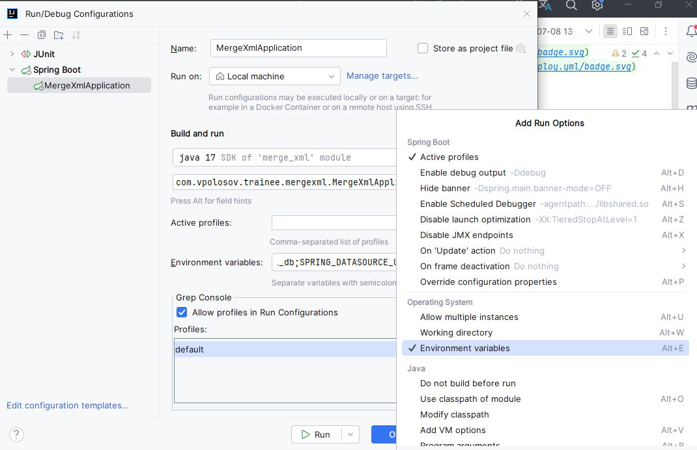
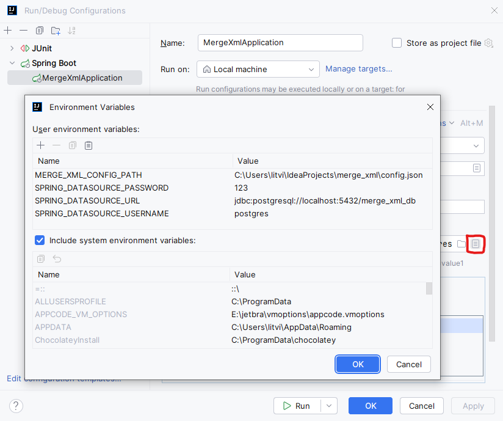

Для запуска необходимо отредактировать конфигурацию:

1. Ставим галочку Modify options -> Environment variables

2. В появившемся поле нажимаем на иконку листа "Edit environment variables" в которой мы заполняем параметры подключения к нашей БД и путь до конфигурационного файла.

3. Запускаем приложение

Для проверки работы приложения необходимо выполнить шаги:

1. Скопировать абсолютный путь до директории с тестовыми фикстурами, например, */home/user/project/merge_xml/src/test/java/com/vpolosov/trainee/merge_xml/test_fixtures/Ok*
2. В Postman отправить **POST** запрос на адрес **localhost:8080/xml**, в Body формат raw Text указать скопированный путь до тестовых фикстур
3. При успешном ответе получим: Total.xml was created!

