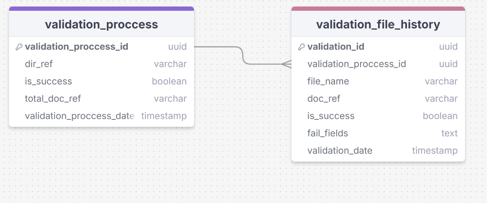

# Валидация платежных документов
В данной фиче, в разработку берется валидационный эндпоинт, на вход которого поступает директория, содержащая в себе платежные документы, которые планируется объединить в один документ. Провалидированные документы записываются в таблицу validation_file_history, а валидируемая директория записывается в таблицу validation_process общей базы данных проекта merge_xml_db.
## Структура БД
В этой задаче создается новый файл миграции баз данных для Liquibase, исходя из документации проекта:

### Описание сущностей базы данных:
| Сущность                | Описание                                                                                           |
|-------------------------|----------------------------------------------------------------------------------------------------|
| validation_process      | Содержит информацию о каталоге с файлами платежей                                                  |
| validation_file_history | Содержит информацию о валидируемых файлах, а также о результатах валидации и об ошибках валидации. |

**validation_process**

| Атрибут                 | Тип данных | Описание                                                       | Ограничение     | Пример                              |
|-------------------------|------------|----------------------------------------------------------------|-----------------|-------------------------------------|
| validation_process_id   | uuid       | Уникальный идентификатор                                       | primary_key     | 71f5135e-fb46-415c-b4cf-bbb9be5692d |
| dir_ref                 | varchar    | Cсылка в windows проводнике на каталог с валидируемыми файлами | nullable: false | c:/Users/Ivanov/test/               |
| is_success              | boolean    | Прошел валидацию каталог или нет                               | nullable: false | true false                          |
| total_doc_ref           | varchar    | Ссылка на итоговый документ                                    | nullable: false | с:/Users/Ivanov/test/total          |
| validation_process_date | timestamp  | Дата завершения процесса валидации                             | nullable: false | 2023-11-14 15:02:38.550722          |

**validation_file_history**

| Атрибут               | Тип данных | Описание                                          | Ограничение     | Пример                              |
|-----------------------|------------|---------------------------------------------------|-----------------|-------------------------------------|
| validation_id         | uuid       | Уникальный идентификатор                          | primary_key     | 71f5135e-fb46-415c-b4cf-bbb9be5692d |
| validation_process_id | uuid       | Уникальный идентификатор                          | foreign_key     | 71f5135e-fb46-415c-b4cf-bbb9be5692d |
| file_name             | varchar    | Имя файла                                         | nullable: false |                                     |
| doc_ref               | varchar    | Ссылка в windows проводнике на  валидируемый файл | nullable: false | с:/Users/Ivanov/test/pay            |
| is_success            | boolean    | Прошел валидацию файл или нет                     | nullable: false | true false                          |
| fail_fields           | text       | Поля файла, которые не прошли валидацию           | nullable: true  |                                     |
| validation_date       | timestamp  | Дата завершения валидации файла                   | nullable: false | 2023-11-14 15:02:38.550722          |

## Пользовательский ввод
JSON файл, содержащий в себе директорию с платежными документами.

## Вывод пользователю
Если в результате валидации возникает ошибка, производится запись в базу данных о причине провала валидации (просмотр истории валидации пользователя доступен в "Просмотр истории валидации" и "Просмотр истории смердженных файлов"), а пользователю выводится ошибка 400 "Не пройдена валидация" в JSON. Если валидация прошла успешна, так же производиться запись в базу данных и пользователю отправляется статус 200.

## Схема валидации
1) Система проверяет плательщика: он должен быть один во всех платежных документах. Если плательщики разные в поле fail_fields таблицы validation_file_history сохраняет сообщение: “Имя плательщика <Имя> отличается от имени представленного в предыдущем валидируемом файле <Имя>”;
2) Минимальная сумма платежа в документе должна быть больше или равна 10.00 рублям. Также система сохраняет соответствующее сообщение об ошибке в fail_fields, если сумма меньше 10.00 рублей: “Минимальная сумма платежа 10.00 руб.”;
3) Код валюты в платежном документе может быть только 810. Если код валюты не соответсвует этим требованиям, то в поле fail_fields сохраняется сообщение: "Код валюты <Код валюты> не поддерживается сервисом";
4) Дата платежа должна быть равна текущей дате.Также система сохраняет соответствующее сообщение об ошибке в fail_fields, если дата меньше или больше текущей: “Дата платежного документа должна быть равна текущей дате”;
5) Система должна автоматически устанавливать дату платежного документа (DOCUMENTDATE) равной текущей дате на момент создания нового платежного документа. Эта дата должна заполняться системой по умолчанию;
6) Параметры CODEREV, PAYTYPEPARAM, PAYGRNDPARAM должны соответствовать зависимостям указанным в таблице ниже. В случае не соответсвия сохраняется сообщение в fail_fields: "Не валидный параметр <Параметр>";

**Таблица соответствия показателей «тип платежа» в зависимости от «основания платежа»:**

| CODEREV, Код программ доходов бюджетов | PAYTYPEPARAM, тип платежа | PAYGRNDPARAM, основание платежа |
|----------------------------------------|---------------------------|---------------------------------|
| 1                                      | НС, АВ (ПЛ, ВЗ, ГП)       | ТП                              |
| 1                                      | НС                        | ЗД, ТР, АП, АР                  |
| 1                                      | НС                        | ОТ, РС, ПР, ВУ                  |
| 1                                      | НС                        | РТ                              |
| 2                                      | ПЕ                        | ЗД,ТР,ОТ,РС,РТ,ВУ,ПР,АП,АР      |
| 2                                      | ПЦ                        | РС, ОТ, РТ, ПР, ВУ              |
| 3                                      | СА, АШ, ИШ                | ЗД,ТР,РС,РТ,ВУ,ПР,АП,АР         |

**PAYGRNDPARAM, основание платежа:**

| Сокращение | Описание                                                                                                     |
|------------|--------------------------------------------------------------------------------------------------------------|
| ТП         | платеж текущего года без нарушения срока (текущий платеж)                                                    |
| ЗД         | добровольное погашение задолженности по истекшим налоговым периодам                                          |
| БФ         | текущие платежи физических лиц - клиентов банка (владельцев счета), уплачиваемые со своего банковского счета |
| ТР         | требование налогового органа                                                                                 |
| РС         | погашение рассроченной задолженности в соответствии с графиком рассрочки                                     |
| ОТ         | погашение отсроченной задолженности                                                                          |
| РТ         | погашение реструктурируемой задолженности                                                                    |
| ВУ         | погашение отсроченной задолженности в связи с введением внешнего управления                                  |
| ПР         | перечисление в счет погашения задолженности, приостановленной ко взысканию                                   |
| АП         | погашение задолженности по акту проверки                                                                     |
| АР         | погашение задолженности по исполнительному документу                                                         |

**PAYTYPEPARAM, тип платежа**

| Сокращение | Описание                                                                                   |
|------------|--------------------------------------------------------------------------------------------|
| НС         | уплата налога или сбора                                                                    |
| АВ         | уплата аванса или предоплата (в том числе декадные платежи)                                |
| ПЛ         | уплата платежа                                                                             |
| ГП         | уплата пошлины                                                                             |
| ВЗ         | уплата взноса                                                                              |
| ПЕ         | уплата пени                                                                                |
| ПЦ         | уплата процентов                                                                           |
| СА         | налоговые санкции, установленные Налоговым кодексом Российской Федерации                   |
| АШ         | административные штрафы                                                                    |
| ИШ         | иные штрафы, установленные соответствующими законодательными или иными нормативными актами |

7) Также, требуется осуществить проверку на повторную загрузку поступающих платежных документов уже объединенных в один документ. В случае обнаружения дубля в поле fail_fields сохраняется сообщение: "Данный платежный документ уже был объединен в общий документ";
8) Платежный документ должен соответствовать схеме, представленной в таблице ниже. Схема валидации представлена xsd схемой - ее предлагается хранить на сервере, выдавать клиенту по get запросу эндпоинта "Просмотр настроек валидации" и вносить в нее правки с фронта, передавая в JSON изменения, которые необходимо внести в xsd схему через эндпоинт "Внесение новых настроек валидации". Если документ не соответсвует, то в поле fail_fields сохраняется сообщение: "Платежный документ на соответсвует схеме валидации".

- BSMessage - название основного элемента, он делится на две части:
- - BSHead - информация о клиенте (тип сообщения, версия и другие данные, относящиеся в сообщению в целом)
- - BSRequest - основная информация о платеже (DOCUMENTS)

**BSHead:**

| Элемент           | Описание                                                                                                                                      | Тип данных | Ограничения | Значения | Обязательно | Пример                                     |
|-------------------|-----------------------------------------------------------------------------------------------------------------------------------------------|------------|-------------|----------|-------------|--------------------------------------------|
| BSHead            |                                                                                                                                               |            |             |          |             |                                            |
| RSys              | данные системы отправителя                                                                                                                    | string(15) |             |          | да          | DBO2 Дистанционное банковское обслуживание |
| ASys              | данные системы получателя                                                                                                                     | string(15) |             |          | да          | CFT2                                       |
| Route             | маршрутный номер (Данный реквизит отсутствует у российских банков)                                                                            | string(20) |             |          | да          |                                            |
| Client            | Данные по клиенту ComplexType                                                                                                                 |            |             |          |             |                                            |
| RCustID           | Request Customer ID (запрашиваемый пользовательский id) Отправитель                                                                           | string(32) |             |          | да          | 200000817                                  |
| ACustID           | Accepted Customer ID (получаемый пользовательский id) Получатель                                                                              | string(32) |             |          | да          | 200000817                                  |
| INN               | Идентификационный номер налогоплательщика                                                                                                     | string(14) |             |          | да          | 5001087596                                 |
| Branch            | филиал финансовой организации ComplexType                                                                                                     |            |             |          |             |                                            |
| RBranchID         | номер конкретного филиала одного банка Отправитель                                                                                            | string(32) |             |          | да          |                                            |
| ABranchID         | номер конкретного филиала одного банка Получатель                                                                                             | string(32) |             |          | да          |                                            |
| BIC               | БИК (банковский идентификационный код) это девятизначный уникальный номер, который есть у каждого банковского отделения на территории России. | string(15) |             |          | да          | 044525411                                  |
| Office            | данные по офису банка ComplexType                                                                                                             |            |             |          |             |                                            |
| Officecode        | код офиса                                                                                                                                     |            |             |          | да          | 081                                        |
| union memberTypes | Определяет список из встроенных типов данных или элементов simpleType, декларированных в схеме                                                | int        |             |          | нет         |                                            |
| restriction base  | Определяет имя встроенного типа данных, элемента simpleType или элемента complexType, определенных в этой или другой схеме                    | string     |             |          | да          |                                            |
| enumeration value |                                                                                                                                               |            |             |          |             |                                            |
| Robotuser         | бот                                                                                                                                           | string(50) |             |          | да          |                                            |

**BSRequest:**

| №п/п | Элемент              | Описание                                                                                                                                                                                       | Тип данных    | Ограничения                                             | Значения                    | Обязательно | Пример                                          |
|------|----------------------|------------------------------------------------------------------------------------------------------------------------------------------------------------------------------------------------|---------------|---------------------------------------------------------|-----------------------------|-------------|-------------------------------------------------|
| 1    | AMOUNT               | Сумма платежа                                                                                                                                                                                  | decimal(15,2) |                                                         | от 10.00 до 999999999999.99 | Да          | 12312.00                                        |
| 2    | CBCCODE              | Код CBC (Код бюджетной классификации)                                                                                                                                                          | string(20)    |                                                         |                             | Да          |                                                 |
| 3    | CURRCODE             | Код валюты                                                                                                                                                                                     | string(3)     |                                                         |                             | Да          | 810                                             |
| 4    | CUSTID               | Идентификатор абонента                                                                                                                                                                         | string(100)   |                                                         |                             | Нет         | 200000126                                       |
| 5    | IP                   | IP-адрес                                                                                                                                                                                       | string(40)    |                                                         |                             | Нет         | 10.223.89.62                                    |
| 6    | MAC                  | MAC-адрес                                                                                                                                                                                      | string(20)    |                                                         |                             | Нет         |                                                 |
| 7    | DOCDATEPARAM1        | Показатель даты документа (109) DocDateParam1 (dd), DocDateParam2 (mm), DocDateParam3 (yyyy)                                                                                                   | string(2)     |                                                         |                             | Да          | 0                                               |
| 8    | DOCDATEPARAM2        | Показатель даты документа (109) DocDateParam1 (dd), DocDateParam2 (mm), DocDateParam3 (yyyy)                                                                                                   | string(2)     |                                                         |                             | Да          |                                                 |
| 9    | DOCDATEPARAM3        | Показатель даты документа (109) DocDateParam1 (dd), DocDateParam2 (mm), DocDateParam3 (yyyy)                                                                                                   | string(4)     |                                                         |                             | Да          |                                                 |
| 10   | DOCNUMPARAM1         | Показатель номера документа                                                                                                                                                                    | string(2)     |                                                         |                             | Да          |                                                 |
| 11   | DOCNUMPARAM2         | Показатель номера документа                                                                                                                                                                    | string(15)    |                                                         |                             | Да          | 0                                               |
| 12   | GROUND               | Основание платежа                                                                                                                                                                              | string(255)   |                                                         |                             | Да          | В том числе НДС 10% - 1 119.27                  |
| 13   | OKATOCODE            | Код ОКАТО                                                                                                                                                                                      | string(11)    |                                                         |                             | Да          | 0                                               |
| 14   | CODEREV              | Код программ доходов бюджетов                                                                                                                                                                  | string(1)     |                                                         |                             | Да          | 1                                               |
| 15   | OPERTYPE             | Вид операции                                                                                                                                                                                   | string(2)     |                                                         |                             | Да          | 01                                              |
| 16   | PAYGRNDPARAM         | Показатель основания платежа                                                                                                                                                                   | string(2)     |                                                         |                             | Да          | 0                                               |
| 17   | PAYTYPEPARAM         | Показатель типа платежа                                                                                                                                                                        | string(2)     |                                                         |                             | Да          |                                                 |
| 18   | DATEBILLON           | Дата выставления счета                                                                                                                                                                         | string        | ([\d]{2}\.[\d]{2}\.[\d]{4})                             | ()                          |             | Да                                              |12.07.2024
| 19   | DUEDATA              | Срок оплаты                                                                                                                                                                                    | string (2)    | default                                                 |                             | Да          | 10                                              |
| 20   | PAYUNTIL             | Дата, до которой нужно оплатить                                                                                                                                                                | string        | ([\d]{2}\.[\d]{2}\.[\d]{4})                             | ()                          |             | Да                                              |22.07.2024
| 20   | PAYER                | Плательщик                                                                                                                                                                                     | string(160)   |                                                         |                             | Да          | ООО "САРРАС"                                    |
| 21   | PAYERACCOUNT         | Счет плательщика                                                                                                                                                                               | string(25)    |                                                         |                             | Да          | 40702810501550000110                            |
| 22   | PAYERBIC             | БИК плательщика                                                                                                                                                                                | string(9)     |                                                         |                             | Да          | 044525411                                       |
| 23   | PAYERBANKNAME        | Название банка плательщика                                                                                                                                                                     | string(80)    |                                                         |                             | Да          | Филиал "Центральный" Банка ВТБ (ПАО), г. Москва |
| 24   | PAYERBANKTYPE        | Тип банка плательщика                                                                                                                                                                          | string(10)    |                                                         |                             | Да          |                                                 |
| 25   | PAYERCORRACCOUNT     | Корсчет банка плательщика                                                                                                                                                                      | string(25)    |                                                         |                             | Да          | 30101810145250000411                            |
| 26   | PAYERINN             | ИНН плательщика                                                                                                                                                                                | string(14)    |                                                         |                             | Да          | 5001087596                                      |
| 25   | PAYERKPP             | КПП плательщика                                                                                                                                                                                | string(9)     |                                                         |                             | Да          | 876543210                                       |
| 26   | PAYERPLACE           |                                                                                                                                                                                                | string(25)    |                                                         |                             | Да          |                                                 |
| 27   | PAYERPLACETYPE       |                                                                                                                                                                                                | string(5)     |                                                         |                             | Да          |                                                 |
| 28   | PAYERPROPERTYTYPE    |                                                                                                                                                                                                | string(10)    |                                                         |                             | Да          |                                                 |
| 29   | PAYMENTURGENT        | Очередность платежа                                                                                                                                                                            | string(2)     |                                                         |                             | Да          | 5                                               |
| 30   | RECEIVER             | Название получателя                                                                                                                                                                            | string(160)   |                                                         |                             | Да          | Контрагент ИП 40802                             |
| 31   | RECEIVERACCOUNT      | Счет получателя                                                                                                                                                                                | string(25)    |                                                         |                             | Да          | 40702810400260004426                            |
| 32   | RECEIVERBIC          | БИК получателя                                                                                                                                                                                 | string(9)     |                                                         |                             | Да          | 044525600                                       |
| 33   | RECEIVERBANKNAME     | Название банка получателя                                                                                                                                                                      | string(80)    |                                                         |                             | Да          | АО "МИнБанк", г. Москва                         |
| 34   | RECEIVERBANKTYPE     | Тип банка получателя                                                                                                                                                                           | string(10)    |                                                         |                             | Да          |                                                 |
| 35   | RECEIVERCORRACCOUNT  | Корсчет банка получателя                                                                                                                                                                       | string(25)    |                                                         |                             | Да          | 30101810300000000600                            |
| 36   | RECEIVERINN          | ИНН получателя                                                                                                                                                                                 | string(14)    |                                                         |                             | Да          | 132808730606                                    |
| 37   | RECEIVERKPP          | КПП получателя                                                                                                                                                                                 | string(9)     |                                                         |                             | Да          | 343443488                                       |
| 38   | RECEIVERPLACE        |                                                                                                                                                                                                | string(25)    |                                                         |                             | Да          |                                                 |
| 39   | RECEIVERPLACETYPE    |                                                                                                                                                                                                | string(5)     |                                                         |                             | Да          |                                                 |
| 40   | RECEIVERPROPERTYTYPE |                                                                                                                                                                                                | string(10)    |                                                         |                             | Да          |                                                 |
| 41   | SENDTYPE             | Вид платежа                                                                                                                                                                                    | string(15)    |                                                         |                             | Да          |                                                 |
| 42   | SIGNUID3             | Идентификатор подписи                                                                                                                                                                          | string(51)    |                                                         |                             | Да          | 578aa17718884c61a38c7414671c1b12                |
| 43   | SIGNNAME3            | Подпись                                                                                                                                                                                        | string        |                                                         |                             | Да          | ммммм Лера Лера                                 |
| 44   | STAT1256             | Показатель статуса                                                                                                                                                                             | string(2)     |                                                         |                             | Да          |                                                 |
| 45   | TAXPERIODPARAM1      | Группа полей служит для хранения одной из следующих информаций: -Код таможенного органа. -Показатель налогового периода (107): TaxPeriodParam1 + '.' + TaxPeriodParam2 + '.' + TaxPeriodParam3 | string(8)     |                                                         |                             | Да          | 0                                               |
| 46   | TAXPERIODPARAM2      | Группа полей служит для хранения одной из следующих информаций: -Код таможенного органа. -Показатель налогового периода (107): TaxPeriodParam1 + '.' + TaxPeriodParam2 + '.' + TaxPeriodParam3 | string(2)     |                                                         |                             | Да          |                                                 |
| 47   | TAXPERIODPARAM3      | Группа полей служит для хранения одной из следующих информаций: -Код таможенного органа. -Показатель налогового периода (107): TaxPeriodParam1 + '.' + TaxPeriodParam2 + '.' + TaxPeriodParam3 | string(4)     |                                                         |                             | Да          |                                                 |
| 48   | DATETIMERECEIVE      | Дата и время получения                                                                                                                                                                         | string        | ([\d]{2}\.[\d]{2}\.[\d]{4}:[\d]{2}:[\d]{2}:[\d]{2})\|() |                             | Да          | 22.02.2024:10:15:22                             |
| 49   | SERVICE              | Сервис                                                                                                                                                                                         | string        |                                                         |                             | Да          | WEB                                             |
| 50   | CODEUIP              | Уникальный идентификатор платежа (УИП) или уникальный идентификатор начисления (УИН)                                                                                                           | string(50)    |                                                         |                             | Да          |                                                 |
| 51   | STATUS               | Статус                                                                                                                                                                                         | string        |                                                         |                             | Да          |                                                 |
| 52   | SENDNUMBER           | Номер отправителя                                                                                                                                                                              | string        |                                                         |                             | Да          |                                                 |
| 53   | RECEIVENUMBER        | Номер получателя                                                                                                                                                                               | string        |                                                         |                             | Да          |                                                 |
| 54   | OCREF                | Ref Документа                                                                                                                                                                                  | string(32)    |                                                         |                             | Да          | a3b3c7b6ad9d4a69b02fa06e2a37e8ea                |
| 55   | DOCUMENTDATE         | Дата создания документа                                                                                                                                                                        | string        | ([\d]{2}\.[\d]{2}\.[\d]{4})\|()                         |                             | Да          | 22.02.2024                                      |
| 56   | DOCUMENTNUMBER       | Номер документа                                                                                                                                                                                | string(15)    |                                                         |                             | Да          | 485                                             |
| 56   | DELIVERYTYPE         | Тип доставки                                                                                                                                                                                   | string        |                                                         |                             | Да          | 2                                               |
| 57   | CODEMESSAGE          | Код сообщения для банка                                                                                                                                                                        | string(50)    |                                                         |                             | Да          |                                                 |
| 58   | MESSAGEFORBANK       | Сообщение для банка                                                                                                                                                                            | string(255)   |                                                         |                             | Да          |                                                 |
| 59   | DOCRECID             | RecID Документа                                                                                                                                                                                | string(50)    |                                                         |                             | Да          |                                                 |
| 60   | RESFIELD             |                                                                                                                                                                                                | string(35)    |                                                         |                             | Нет         |                                                 |
| 61   | SIGNHASH             | Подпись                                                                                                                                                                                        | string        |                                                         |                             | Да          |                                                 |

9) Все настройки по валюте, минимального/максимального количества валидируемых файлов, сроков оплаты, минимальных/максимальных платежей, названия итогового (объединенного) документа, его вес хранятся на сервере приложения и выдаются клиенту по get запросу через эндпоинт "Просмотр настроек приложения". Эти настройки пользователь должен быть способен менять в клиенте приложения и отправлять их для сохранения и последующего использования на сервер.  Внесение изменения в настройки осуществляется через эндпоинт "Изменение настроек приложения". В таблице ниже приведено содержимое такого файла (config.json)

**config.json**

№ п/п|Наименование|Описание|Значение
---|---|---|---
1.|currencyCode|код валюты|810
2.|DUEDATE|срок оплаты|10
3.|fileName|имя результирующего файла|Total.xml
4.|maxCountFiles|максимальное количество файлов|10
5.|minCountFiles|минимальное количество файлов|1
6.|minPayment|минимальный платёж|10,00
7.|maxPayment|максимальный платёж|999999999999.99
8.|maxResultFileWeight|максимальный размер одного файла|500

## Что, в дальнейшем, добавить
- Многопоточная валидация документов;
- Добавить таблицу с кодами валюты;
- Переделать поле fail_fields на хранение JSON.